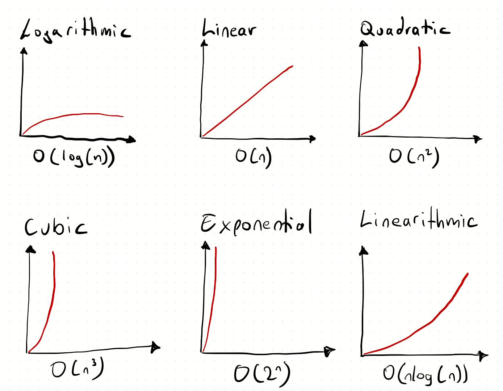

<p align="center">
  
</p>

# sorting_algorithms

> Sorting is not just putting things in order — it's understanding *how* and *why* one order beats another.

---

## 📝 Description

This project is part of the low-level programming curriculum at Holberton School and was completed as a **pair programming project**. It covers the implementation of four classic sorting algorithms in C, applied to both arrays and doubly linked lists. For each algorithm, I implement the sorting logic, print intermediate states after every swap, and document the time complexity using Big O notation for the best, average, and worst cases. Sorting algorithms are a cornerstone of computer science: they build algorithmic thinking, reinforce Big O analysis, and demand precise pointer manipulation — all in strict C style.

---

## 🤝 Pair Programming — How We Worked Together

This project was completed in collaboration with **Alison Amblard** ([@Ali731-Amb](https://github.com/Ali731-Amb)).

We divided the workload as follows:
- **Gwenaelle** handled the **even-numbered tasks** (0 — Bubble Sort, 2 — Selection Sort)
- **Alison** handled the **odd-numbered tasks** (1 — Insertion Sort, 3 — Quick Sort)

Beyond the task split, we maintained continuous communication throughout the project: we made all architectural decisions jointly, reviewed each function together before pushing, shared debugging sessions for pointer and list manipulation issues, and discussed Big O reasoning as a team. Both of us fully understand every part of the code, regardless of who typed it. This mirrors real-world collaborative development: shared responsibility, consistent style, and synchronized progress.

---

## 🎯 Learning Objectives

At the end of this project, I am able to implement at least four different sorting algorithms and explain the characteristics of each. I understand what Big O notation is and how to evaluate the time complexity of an algorithm in the best, average, and worst cases. I know how to select the most appropriate sorting algorithm depending on the nature and constraints of the input. I can also explain what a stable sorting algorithm is, why stability matters, and which of the implemented algorithms are stable and which are not.

---

## 🛠️ Technologies Used

All programs in this project are written in **C** and compiled on **Ubuntu 20.04 LTS** using `gcc` with the flags `-Wall -Werror -Wextra -pedantic -std=gnu89`. Code style is enforced by the **Betty linter**. Standard library functions such as `printf` and `puts` are forbidden unless explicitly allowed — the provided `print_array` and `print_list` utilities are used instead. All function prototypes, including those of `print_array` and `print_list`, are declared in `sort.h`, which uses include guards.

The data structure used for linked list tasks is:

```c
typedef struct listint_s
{
    const int n;
    struct listint_s *prev;
    struct listint_s *next;
} listint_t;
```

---

## ⚙️ Requirements

- **OS:** Ubuntu 20.04 LTS
- **Compiler:** `gcc` with options `-Wall -Werror -Wextra -pedantic -std=gnu89`
- **Allowed editors:** `vi`, `vim`, `emacs`
- All files must end with a **new line**
- No errors and no warnings during compilation
- Global variables are **not allowed**
- No more than **5 functions per file**
- Standard library functions (`printf`, `puts`, etc.) are **forbidden** unless explicitly stated
- Must use the provided `print_array` and `print_list` functions
- All function prototypes (including `print_array` and `print_list`) must be declared in `sort.h`
- All header files must be **include guarded**
- A list or array does not need to be sorted if its size is less than 2
- Do not push `main.c` test files
- Code must follow the **Betty style**
- **One repository per pair** — cloning or forking after the second deadline risks a score of 0%
- Big O notation files must have one notation per line and end with a newline
- Use the short notation: no constants, e.g. `O(n)` not `O(2n)`

---

## 🚀 Installation

```bash
git clone https://github.com/GwenP88/holbertonschool-sorting_algorithms.git
cd holbertonschool-sorting_algorithms
```

---

## ▶️ Usage / Execution

Compile any sorting function with its test main and the required print utility:

```bash
gcc -Wall -Wextra -Werror -pedantic -std=gnu89 0-bubble_sort.c 0-main.c print_array.c -o bubble
./bubble
```

For the linked list task:

```bash
gcc -Wall -Wextra -Werror -pedantic -std=gnu89 1-main.c 1-insertion_sort_list.c print_list.c -o insertion
./insertion
```

Replace filenames as appropriate for each task.

---

## 📊 Project Progress

<p align="center">

</p>

<p align="center">
<sub>Mandatory tasks completion: 100%</sub>
</p>

---

<p align="center">
  
</p>

## ✨ Features

### Task 0 - Bubble Sort

- Mandatory — handled by **Gwenaelle**
- Write a function that sorts an array of integers in ascending order using Bubble Sort; print the array after each swap
- Prototype: `void bubble_sort(int *array, size_t size);` — must use `print_array`; no action if `size < 2`
- Repeatedly compares and swaps adjacent elements until the array is sorted; prints intermediate state after every swap

**Big O — file `0-O`:**
- Best case: `O(n)`
- Average case: `O(n^2)`
- Worst case: `O(n^2)`

**Files:** `0-bubble_sort.c`, `0-O`

---

### Task 1 - Insertion Sort (Doubly Linked List)

- Mandatory — handled by **Alison**
- Write a function that sorts a doubly linked list of integers in ascending order using Insertion Sort; nodes must be swapped, not their integer values; print the list after each node swap
- Prototype: `void insertion_sort_list(listint_t **list);` — `n` inside each node cannot be modified; bidirectional linkage must remain correct
- Inserts each element into its correct position by moving nodes rather than values; maintains stable ordering

**Big O — file `1-O`:**
- Best case: `O(n)`
- Average case: `O(n^2)`
- Worst case: `O(n^2)`

**Files:** `1-insertion_sort_list.c`, `1-O`

---

### Task 2 - Selection Sort

- Mandatory — handled by **Gwenaelle**
- Write a function that sorts an array of integers in ascending order using Selection Sort; print the array after each swap
- Prototype: `void selection_sort(int *array, size_t size);` — must use `print_array`
- Finds the minimum element in the unsorted portion and swaps it into position; not stable

**Big O — file `2-O`:**
- Best case: `O(n^2)`
- Average case: `O(n^2)`
- Worst case: `O(n^2)`

**Files:** `2-selection_sort.c`, `2-O`

---

### Task 3 - Quick Sort (Lomuto Partition)

- Mandatory — handled by **Alison**
- Write a function that sorts an array of integers in ascending order using Quick Sort with the Lomuto partition scheme; the pivot is always the last element of the current partition; print the array after each swap
- Prototype: `void quick_sort(int *array, size_t size);` — correct Lomuto partitioning required; must prevent infinite recursion on small partitions
- Recursively divides the array around a pivot and sorts each partition; not stable; very efficient on average

**Big O — file `3-O`:**
- Best case: `O(nlog(n))`
- Average case: `O(nlog(n))`
- Worst case: `O(n^2)`

**Files:** `3-quick_sort.c`, `3-O`

---

## 🤝 Contributions & Acknowledgements

Thanks to Holberton School for a project that makes sorting feel like both an art and a science. Every algorithm has its own personality — Bubble Sort is patient and methodical, Quick Sort is bold and recursive, Insertion Sort is careful and stable, and Selection Sort is honest about how much work it does. Working through all of them as a pair meant we could debate trade-offs out loud and actually internalize the differences. Thanks to **Alison** for the solid collaboration, sharp debugging instincts, and shared enthusiasm for getting Big O right.

---

## 👤 Authors

**Gwenaelle PICHOT**
- Student at Holberton School
- Track: `holbertonschool-sorting_algorithms`
- Project: `sorting_algorithms`
- GitHub: [@GwenP88](https://github.com/GwenP88)

**Alison Amblard**
- Student at Holberton School
- Track: `holbertonschool-sorting_algorithms`
- Project: `sorting_algorithms`
- GitHub: [@Ali731-Amb](https://github.com/Ali731-Amb)